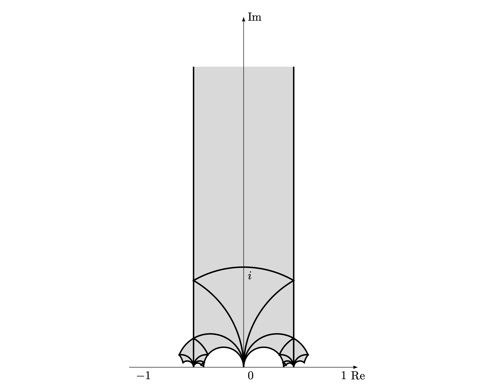

# Fundamental Domain Visualizer

This can generate both LaTeX/Tikz and Asymptote code to draw a fundamental domain of some specific subgroups of $SL_2(\mathbb{Z})$, for example $\Gamma_0(N)$, $\Gamma_1(N)$, $\Gamma(N)$.

